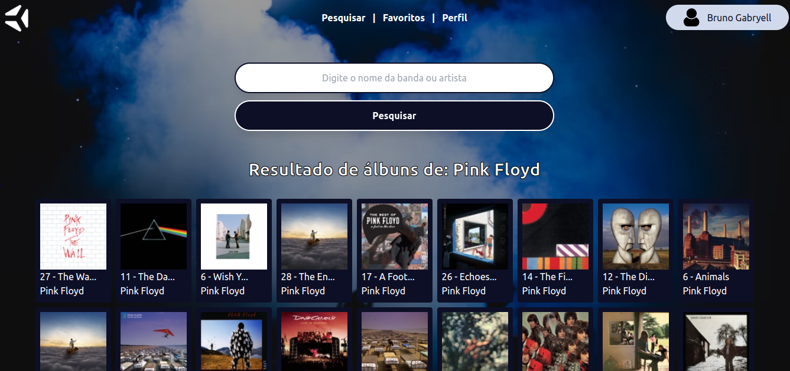

<h1 align="center">Trybe Tunes</h1>

Aplicação desenvolvida como critério avaliativo da Trybe com a função de servir como plataforma de música para o usuário, que pode pesquisar e favoritar músicas, além de editar informações de cadastro.

<h3 align="center">https://brunocabralsilva.github.io/trybe-14-tunes/</h3>

<h2> Índice</h2>

* [Descrição do Projeto](#descrição-do-projeto)
* [Mapeamento do Site](#mapeamento)
* [Tecnologias utilizadas](#tecnologias-utilizadas)
* [Desenvolvedores e demais contribuidores](#pessoas-envolvidas)
* [Conclusão](#conclusão)

<h2 id="descrição-do-projeto">Descrição do Projeto</h2>

O Trybe Tunes foi o décimo quarto projeto realizado na trybe durante o módulo de Front-End, onde foi desenvolvida uma aplicação que cumpria diversas funções, sendo cada uma delas:

<ul>
    <li>Fazer login;</li>
    <li>Pesquisar por uma banda ou artista;</li>
    <li>Listar os álbuns disponíveis dessa banda ou artista;</li>
    <li>Visualizar as músicas de um álbum selecionado;</li>
    <li>Reproduzir uma prévia das músicas deste álbum;</li>
    <li>Favoritar e desfavoritar músicas;</li>
    <li>Ver a lista de músicas favoritas;</li>
    <li>Ver o perfil da pessoa logada;</li>
    <li>Editar o perfil da pessoa logada.</li>
</ul>

    Com o intuito de alcançar os objetivos do projeto, foram utilizados diversos conceitos que envolvem os seguintes pontos abaixo:

<ul>
    <li>Fazer requisições e consumir dados vindos de uma API;</li>
    <li>Utilizar os ciclos de vida de um componente React;</li>
    <li>Utilizar a função setState de forma a garantir que um determinado código só é executado após o estado ser   atualizado;</li>
    <li>Utilizar o componente BrowserRouter corretamente;</li>
    <li>Criar rotas, mapeando o caminho da URL com o componente correspondente, via Route;</li>
    <li>Utilizar o Switch do React Router;</li>
    <li>Usar o componente Redirect pra redirecionar para uma rota específica;</li>
    <li>Criar links de navegação na aplicação com o componente Link.</li>
</ul>

<h2 id="mapeamento">Mapeamento do site </h2>

<ol>
<li><h4>Login</h4></li> 

Primeira página da aplicação onde o usuário precisa digitar um login com mais de tês caracteres para que seja habilitado o botão de Login.

<li><h4>Pesquisar</h4></li>

Área destinada para pesquisar por uma música, artista ou álbum. Ao clicar em pesquisar, todos os álbuns que correspondem ao que foi digitado são exibidos.

<li><h4>Álbum</h4></li>

Caso o usuário clique em algum dos ícones que foram exibidos como resultado da busca na ppágina de pesquisa, ele será direcionado para uma nova página onde serão exibidas todas as faixas do álbum relacionado ao ícone clicado. Nesta área é possível ouvir uma prévia de cada uma das faixas, além de favoritar ou desfavoritar a música. Ao acessar a página, automaticamente as músicas favoritadas anteriormente já são carregadas como favoritas (o checkbox relacionado à função de favoritar já vem como marcado).

<li><h4>Favoritos</h4></li>

Nesta página são exibidas todas as músicas favoritadas pelo usuário. Também é possível ouvir uma prévia das músicas assim como na página álbuns. Caso o usuário desfavorite uma das músicas desmarcando o checkbox referente à função citada, automaticamente a música some da lista.

<li><h4>Perfil</h4></li>

 Área destinada para a visualização dos dados do usuário, tais como: 

<ul>
    <li>Nome;</li>
    <li>E-mail;</li>
    <li>Descrição;</li>
    <li>Imagem.</li>
</ul>

Caso o usuário deseje adicionar ou alterar informações do seu cadastro, basta clicar no botão "Editar Perfil.

<li><h4>Editar Perfil</h4></li>

 Página onde o usuário pode alterar todas as informações supracitadas. É importante destacas que, para inserir uma imagem, o usuário precisa inserir um link de uma imagem. Ao clicar em Editar Pefil, as alterações são efetivadas na aplicação.

</ol>

<h2 id="tecnologias-utilizadas">Tecnologias utilizadas:</h2>

* `HTML5`
* `CSS3`
* `Javascript (ECMAScript 2018)`
* `React`
* `React Icons`
* `Tailwind`
* `React Router Dom`
* `Framer Motion`
* `Font Awesome`

<h2 id="pessoas-envolvidas">Desenvolvedores e demais contribuidores</h2>

* <strong>Bruno Gabryell Cabral da Silva</strong> - Desenvolvedor Web;

<h2 id="conclusão">Conclusão</h2>

Programar é um eterno aprendizado. Quanto mais se pratica, mais se melhora. Praticar conceitos de programação com coisas que se é apaixonado apimenta ainda mais a relação! Muitos aprendizados novos são adicionados a cada dia, fazendo com que este projeto já tenha valido a pena antes mesmo de ser concluído!

